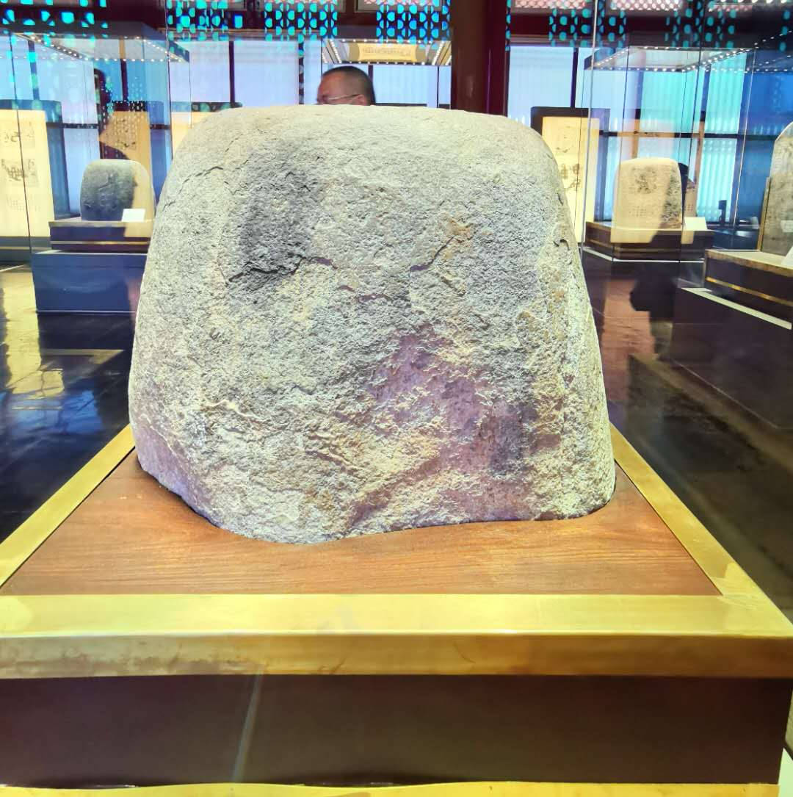
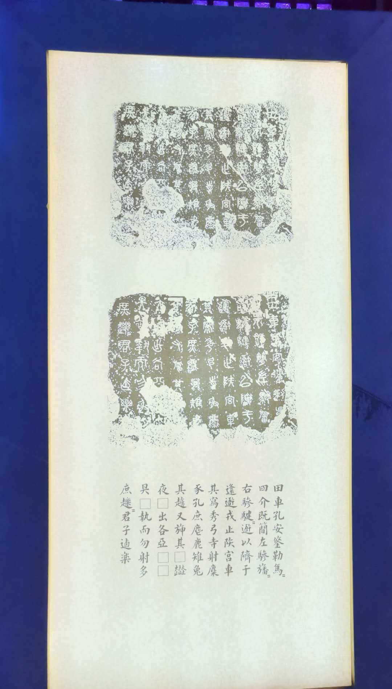

石鼓文又称史籀、猎碣、大篆等，其内容是记载秦宣王牧猎的诗歌，因其刻圆石上而被称为石鼓文。展出今存十枚石鼓文因千年风霜，文字大部分已脱落或难以辨认。石鼓文于唐代在今宝鸡陈仓发现，当时存字有 700 多字，现存字为 300 多字。石鼓文是介于金文和小篆之间的字体，字迹雄强刚劲。因宋徽宗喜爱，石鼓文藏于开封，后又转移于临安，后又被金人掠至北京。元、明、清各朝，石鼓文均藏于北京。在抗战期间，为保护文物，石鼓文被转移至南京等。建国后石鼓文又回到故宫博物物，成为镇馆之宝之一。石鼓文为书法界所推崇，著名书法家吴昌硕以石鼓文为师从而形成自己的风格。因夫人学习书法，2020 年 9 月 22 日，我与夫人特到故宫皇极殿石鼓文馆拜谒。有感鼓石鼓文的遒劲和经历，特填词以记。

